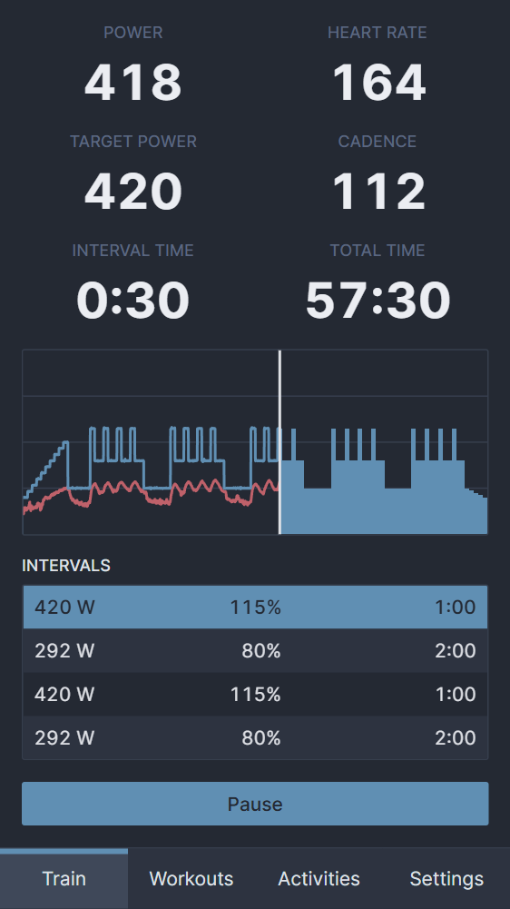
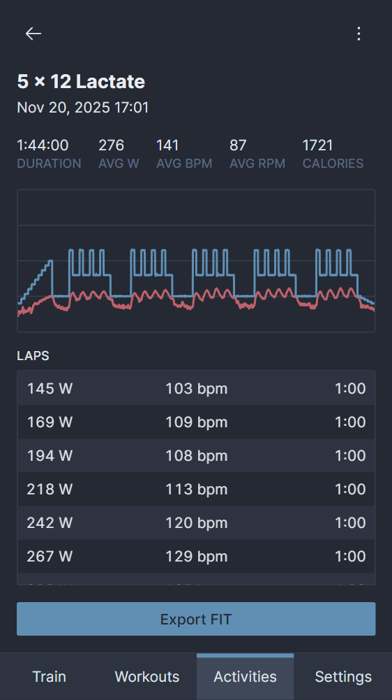

# workin
A web app to create and run smart trainer workouts.

## Limitations
- The Web Bluetooth API is used to communicate with heart rate monitors and smart trainers. It is currently only supported by [Chromium browsers](https://developer.mozilla.org/en-US/docs/Web/API/Web_Bluetooth_API#browser_compatibility). Chrome on iOS devices [doesn't support Web Bluetooth](https://support.google.com/chrome/answer/6362090?hl=en&co=GENIE.Platform%3DiOS). You will need to use an app like [Bluefy](https://apps.apple.com/us/app/bluefy-web-ble-browser/id1492822055) that does.
- Smart trainers must implement the [Fitness Machine Service protocol](https://www.bluetooth.com/specifications/specs/fitness-machine-service-1-0/). You may need to update your trainers firmware to the latest version.
- There is no Strava integration. You will need to export the activity to TCX and [upload it manually](https://www.strava.com/upload/select).
- Data is stored locally in the IndexedDB. If you want to create a backup or share it with other devices, you can use the [backup page](https://workin.smolka.dev/backup) to import/export it.

## Screenshots

