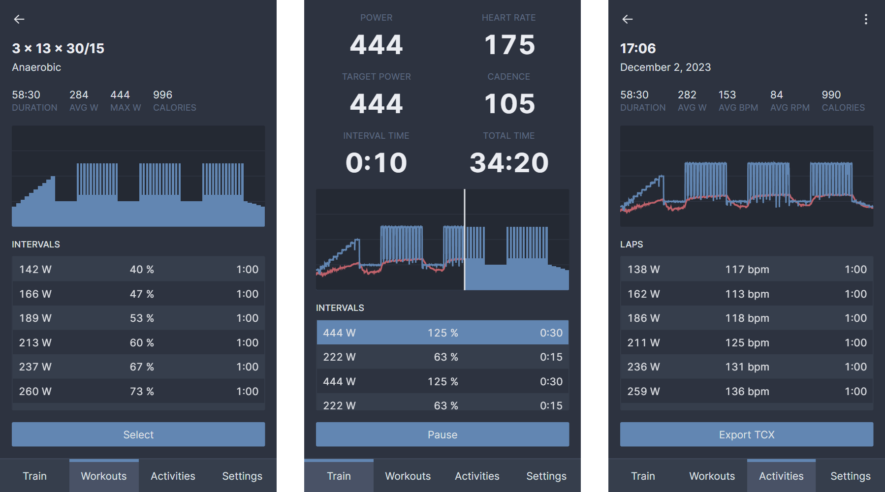

# workin
An app to create and run smart trainer workouts.

## Support
workin uses the Web Bluetooth API, which is currently only supported by [Chromium browsers](https://developer.mozilla.org/en-US/docs/Web/API/Web_Bluetooth_API#browser_compatibility). Chrome on iOS devices [doesn't support Bluetooth](https://support.google.com/chrome/answer/6362090?hl=en&co=GENIE.Platform%3DiOS). You will need to use an app like [Bluefy](https://apps.apple.com/us/app/bluefy-web-ble-browser/id1492822055) that does.

